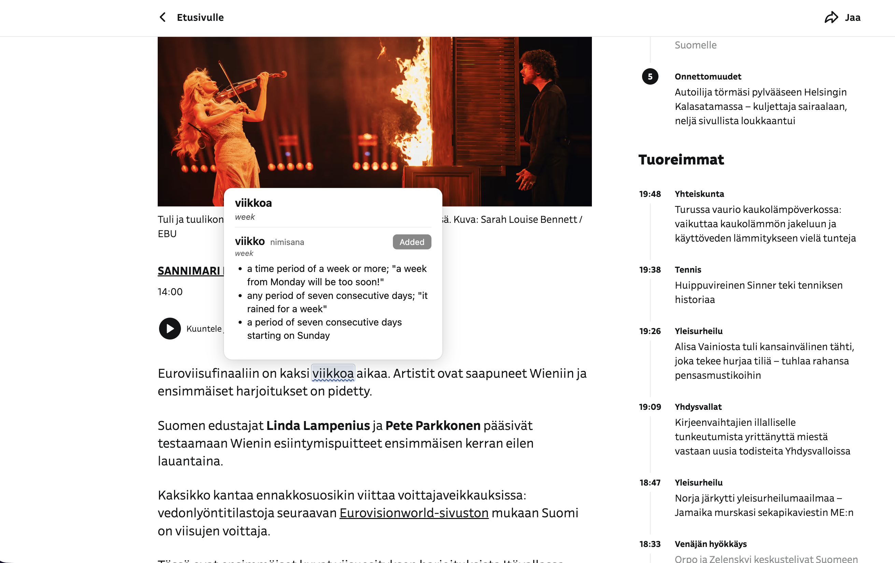
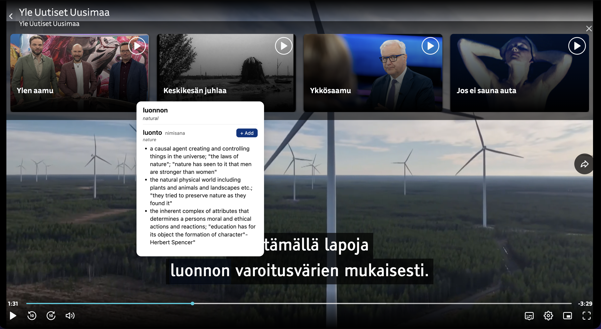

# Finnish Dictionary Extension 🇫🇮

A browser extension for learning Finnish. Activate dictionary mode on any Finnish page to look up words instantly — no copy-pasting, no switching tabs.

## Features

**🔍 Click to look up words**
Click the toolbar button to enable dictionary mode. Hover over any Finnish word to see its base form, word class, and definitions. Definitions are translated into your chosen language on the fly using on-device AI — nothing is sent to external servers.





**📖 Personal dictionary**
Save words you want to remember with one click. Your personal dictionary shows when each word was added and from which page, and lets you filter by time period.

**🃏 Flashcard quiz**
Practice saved words with a built-in flashcard quiz. Mark each word as remembered or forgotten and track your progress. Filter your dictionary by quiz status to focus on words that need more work.


**🔒 On-device translation**
Definitions are translated locally using the Chrome Translator API (Chrome) or the Bergamot translation engine (Firefox). Your reading history and vocabulary never leave your device.

**🌍 10 interface languages**
The extension UI is fully localized: English, Estonian, Russian, Ukrainian, Arabic, Chinese, Somali, Filipino, Hindi, and Persian.

## Permissions

- **storage** — saves your personal dictionary and preferences locally
- **contextMenus** — adds a "Personal dictionary" shortcut to the toolbar icon right-click menu
- **activeTab / scripting** — injects the hover tooltip into the active tab when dictionary mode is on
- **host_permissions: all URLs** — dictionary mode works on any Finnish page you visit

No data is collected. Everything stays on your device.

## Settings

Open the extension settings to choose:
- **Interface language** — the language used for all extension UI
- **Translation language** — the language definitions are translated into

## Development

```
npm install
npm run dev     # dev build with hot reload
npm run build   # production build
npm run pack    # production build + create extension-x.y.z.zip for the Web Store
npm test        # run tests
```

## License

MIT. See the in-extension licenses page for third-party open source notices.
